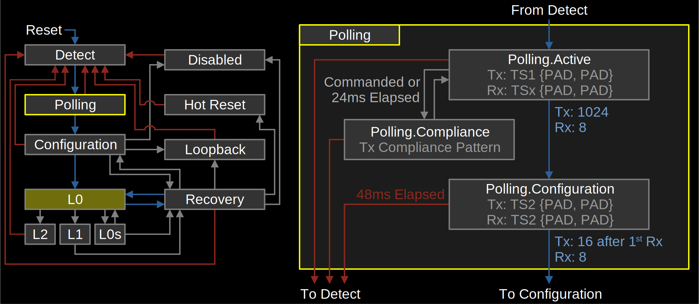

# **PCIe Gen5/Gen6 RTL + UVM + SVA/FV Verification Project**
A layered, end-to-end PCIe Gen5/Gen6 verification framework where AXI traffic is converted to PCIe, exercised through all PCIe layers (TLP → DLL → LTSSM → PHY), and validated by a UVM testbench using scoreboards, assertions, coverage, debug dashboards, and automated CI/CD reporting.

This repository contains an **end-to-end, industry-style PCIe Gen5/Gen6 Endpoint design and verification framework**, including RTL modeling, UVM-based verification, formal properties, transaction-level observability, coverage automation, and CI/CD regression.

It is suitable for **interviews, research, advanced coursework, and verification portfolio demonstration.**

---

## 🚀 **Project Overview**

This project implements a **behaviorally realistic PCIe Endpoint** driven by an **AXI-Lite interface**, verified using **coverage-driven UVM**, strengthened with **SystemVerilog Assertions (SVA) and Formal Verification (FV)**, and supported by **professional debug, observability, and automation infrastructure.**

### **What You Can Claim from This Project**

You can credibly state that you have built and verified:

* A **PCIe Gen5/Gen6 Endpoint** with:

  * LTSSM (Link Training and Status State Machine)
  * Gen5 vs Gen6 negotiation
  * x1 / x4 lane modeling
  * Per-lane skew modeling
  * NRZ vs PAM4 abstraction

* A **PCIe Data Link Layer (DLL)** with:

  * Realistic Tx/Rx sequence numbers
  * Sliding-window retry buffer
  * ACK/NAK handling and replay logic

* **AXI-Lite → PCIe Bridge**

  * Converts AXI writes/reads into PCIe TLPs (MWr/MRd)

* **UVM Verification Environment**

  * Driver, Monitor, Sequencer, Agent, Environment
  * Directed + random sequences
  * Functional scoreboard with golden memory model

* **Coverage-Driven Verification**

  * TLP type coverage
  * Address region coverage
  * Cross coverage (TLP × Address)
  * Automated coverage goals
  * HTML coverage report
  * Excel-based coverage triage

* **Assertion-Based Verification (SVA)**

  * LTSSM correctness checks
  * Credit safety checks
  * Retry buffer validity checks
  * ACK/NAK mutual exclusivity

* **Formal Verification (SVA/FV)**

  * Safety properties (no illegal states)
  * Liveness properties (eventual L0 entry)
  * Skew and recovery correctness

* **Professional Debug & Observability**

  * Custom waveform dashboards (Questa/ModelSim)
  * Clickable assertion viewer
  * SimVision transaction-level tracing for TLPs

* **CI/CD Automation**

  * Batch regression script
  * GitHub Actions workflow
  * Automatic artifact generation and upload

---

## 📁 **Repository Structure**

```
pcie-gen5-gen6-RTL-uvm-coverage/
│
├── README.md
├── Makefile
├── run_coverage_html.tcl
├── run_coverage_goals.tcl
│
├── rtl/
│   ├── pcie_pkg.sv
│   ├── pcie_top.sv
│   ├── ltssm.sv
│   ├── flow_control.sv
│   ├── dll_layer.sv
│   ├── tlp_gen.sv
│   ├── tlp_decode.sv
│   ├── app_mem.sv
│   └── axi2pcie_bridge.sv
│
├── uvm/
│   ├── pcie_uvm_pkg.sv
│   ├── seq_item.sv
│   ├── driver.sv
│   ├── monitor.sv
│   ├── sequencer.sv
│   ├── agent_tx.sv
│   ├── agent_rx.sv
│   ├── scoreboard.sv
│   ├── coverage_collector.sv
│   ├── env.sv
│   └── sequences.sv
│
├── tb/
│   ├── top.sv
│   └── tests/
│       ├── test_link_train.sv
│       ├── test_mwr_mrd.sv
│       ├── test_retry.sv
│       └── test_coverage.sv
│
├── formal/
│   └── pcie_formal.sv
│
├── waves/
│   ├── pcie_dashboard.do
│   ├── pcie_minimal.do
│   ├── pcie_assertions.do
│   └── pcie_simvision.tcl
│
├── scripts/
│   ├── run_wave.do
│   ├── run_assertions.do
│   ├── run_simvision.do
│   ├── gen_coverage_triage_xlsx.tcl
│   └── run_regression.sh
│
├── reports/
│   └── (auto-generated coverage & assertion reports)
│
└── .github/
    └── workflows/
        └── ci.yml
```

---

## 🏗️ **Design Architecture (High Level)**

### **DUT (PCIe Endpoint)**

```
AXI-Lite Master
      │
AXI2PCIe Bridge → PCIe TLP Generator
      │
LTSSM (Gen5/Gen6, x1/x4, skew, NRZ/PAM4)
      │
Flow Control (per-lane credits)
      │
DLL (Seq Numbers + Retry Buffer)
      │
Transaction Layer (TLP Encode/Decode)
      │
App Memory (BAR Space)
```

---

## 🧪 **Verification Architecture (UVM)**

```
UVM Test
   │
pcie_env
   │
├── agent_tx → driver → DUT
│              monitor → coverage + scoreboard
│
├── coverage_collector (functional coverage)
│
└── scoreboard (golden model checking)
```

---

## 🔍 **Formal Verification (SVA/FV)**

The following properties are checked formally:

* **Safety**

  * ACK and NAK must never be asserted together
  * NAK must not be followed by immediate ACK
* **Liveness**

  * The link must eventually reach L0 state
* **Skew Handling**

  * Excessive skew must trigger RECOVERY state
* **Sequence Numbers**

  * Tx sequence numbers must be monotonically increasing

---

## 📊 **Coverage & Reporting**

Running coverage generates:

* `cov_data.ucdb` → Raw coverage database
* `coverage_html/` → Interactive HTML coverage report
* `reports/coverage_triage.xlsx` → Excel triage sheet
* `reports/assertions_report.txt` → Assertion results

---

## 🌊 **Debug & Observability**

### Waveform Dashboards

* `pcie_dashboard.do` → Full debug view (LTSSM, credits, skew, DLL, AXI)
* `pcie_minimal.do` → Lightweight view (clock, reset, state, ACK/NAK)
* `pcie_assertions.do` → Clickable assertion viewer

### SimVision Transaction Tracing

* Every TLP is tracked as a transaction:

  * Type
  * Address
  * Data
  * Tx/Rx sequence numbers

---

## 🔁 **CI/CD Regression (GitHub Actions)**

On every push or PR, the following runs automatically:

1. Compile RTL + UVM + Formal
2. Run coverage test
3. Generate HTML coverage report
4. Generate Excel triage sheet
5. Run assertion-only simulation
6. Upload artifacts to GitHub

---

## ▶️ **How to Run (Questa / EDA Playground)**

### **Compile**

```
vlog rtl/*.sv uvm/*.sv tb/top.sv tb/tests/*.sv formal/*.sv
```

### **Run Coverage Test**

```
vsim -c work.top -do "do run_coverage_goals.tcl"
```

### **View Waveforms**

```
vsim -do scripts/run_wave.do
```

### **Run SimVision**

```
vsim -do scripts/run_simvision.do
```

### **Run Full Regression**

```
./scripts/run_regression.sh
```

---

## 🎯 **Learning Outcomes**

By working with this project, you demonstrate:

* Deep understanding of **PCIe protocol layers**
* Hands-on experience with **RTL design + UVM verification**
* Mastery of **SVA + Formal Verification**
* Practical knowledge of **coverage closure techniques**
* Professional debugging using **SimVision and wave dashboards**
* Experience with **verification automation and CI/CD**

---

## ✍️ **Author**

**Your Name**
BIBIN N BIJI, Senior RTL and DV Engineer, Yarok14 Technologies Pvt Ltd.

---

## 📜 License

MIT License 

---


**clear, structured, “from first principles” explanation of how PCIe Gen5 and Gen6 work** — from physical signals to packets, with what actually changed from Gen5 → Gen6 and why.

I’ll keep it simple first, then precise.

---

# ✅ **1) One-line intuition**

**PCIe = a very fast serial highway between chips.**

* **Gen5 = faster highway than Gen4**
* **Gen6 = same speed as Gen5 *per lane*, but uses smarter signaling (PAM4 + FEC) to double effective throughput.**

---

# 🚦 **2) How PCIe works — big picture**


Every PCIe link has **three layers**:

## **(A) Physical Layer (PHY) — the wires**

This is where **Gen5 vs Gen6 really differs.**

### Gen5 PHY

* **32 GT/s per lane**
* Uses **NRZ encoding** (0 or 1 per bit time)
* 1 symbol = 1 bit

### Gen6 PHY

* Also **32 GT/s per lane**
* But uses **PAM4 encoding** (4 levels: 00, 01, 10, 11)
* 1 symbol = **2 bits**
* Needs **FEC (Forward Error Correction)** to handle noise

👉 **Result:**
Even though both run at 32 GT/s, **Gen6 effectively delivers ~2× the data of Gen5** because each symbol carries 2 bits.

---

## **(B) Data Link Layer (DLL) — reliability**

This layer makes PCIe **reliable**, like TCP for hardware.

It does three key things:

### 1) **Sequence Numbers**

Every packet gets a sequence number:

```
TLP #1 → seq = 0
TLP #2 → seq = 1
TLP #3 → seq = 2
...
```

### 2) **ACK / NAK**

* If receiver gets packet → sends **ACK**
* If receiver detects error → sends **NAK**

### 3) **Retry Buffer (Replay)**

If a NAK happens, the sender **replays** the lost packet from a small buffer.

👉 This is exactly what you modeled in your **dll_layer.sv**.

---

## **(C) Transaction Layer (TL) — packets (TLPs)**

This is where real data moves as **TLPs (Transaction Layer Packets)**.

Common TLPs:

* **MWr** → Memory Write
* **MRd** → Memory Read
* **Cpl** → Completion (response to read)
* **CfgRd / CfgWr** → Configuration access

Example flow:

```
CPU wants to write data →
PCIe generates MWr TLP →
Sent over PHY →
Received by device →
Device writes to memory
```

This is what your **tlp_gen.sv** and **tlp_decode.sv** represent.

---

# 🔗 **3) How a PCIe link actually starts — LTSSM**


Before any data moves, the link goes through **LTSSM (Link Training and Status State Machine)**:

Simplified sequence:

1. **Detect** → Devices see each other
2. **Polling** → Exchange training sequences (TS1/TS2)
3. **Config** → Agree on:

   * Gen5 or Gen6
   * Lane width (x1, x2, x4, x8, x16)
4. **L0 (Active)** → Data transfer begins

If something goes wrong:

* It enters **Recovery**
* Retrains the link

👉 This is what your **ltssm.sv** models (including Gen5/Gen6 choice + x1/x4).

---

# 🔁 **4) Flow Control — Credits**

PCIe uses **credits**, not “ready/valid”.

Each side advertises how much buffer space it has:

Example:

```
Receiver: "I have 8 header credits"
Sender: OK, I can send 8 TLP headers
```

If credits run out → sender **stalls**.

You modeled this in **flow_control.sv (x1 vs x4 credits).**

---

# 🔍 **5) Gen5 vs Gen6 — exact differences (table)**

| Feature        | **Gen5**               | **Gen6**                 | What you modeled             |
| -------------- | ---------------------- | ------------------------ | ---------------------------- |
| Speed per lane | 32 GT/s                | 32 GT/s                  | Same clock rate              |
| Encoding       | **NRZ (1 bit/symbol)** | **PAM4 (2 bits/symbol)** | You abstracted as tags       |
| Error control  | Basic                  | **Strong FEC**           | You modeled error via NAK    |
| Throughput     | ~4 GB/s per lane       | ~8 GB/s per lane         | Implicit in PAM4 abstraction |
| LTSSM          | Same base              | Same + better recovery   | You modeled recovery         |
| Lane widths    | x1, x2, x4, x8, x16    | Same                     | You modeled x1/x4            |
| Skew tolerance | Lower                  | Higher                   | You modeled skew → recovery  |

---

# 🧠 **6) How your project maps to real PCIe**

Here’s how your design aligns with real hardware:

| Real PCIe block   | Your module                    |
| ----------------- | ------------------------------ |
| PHY (SerDes)      | Abstracted (NRZ/PAM4 tag)      |
| LTSSM             | **ltssm.sv**                   |
| Flow control      | **flow_control.sv**            |
| Data Link Layer   | **dll_layer.sv** (seq + retry) |
| Transaction Layer | **tlp_gen / tlp_decode**       |
| Endpoint memory   | **app_mem.sv**                 |
| Host interface    | **axi2pcie_bridge.sv**         |

---

# 🔄 **7) End-to-end example (Gen6 write)**

Step-by-step:

1. **AXI master writes 0xAA55 to 0x1000**
2. **AXI2PCIe bridge** builds a **MWr TLP**
3. **LTSSM is in L0 (Gen6, x4, PAM4)**
4. **Flow control** checks credits → OK
5. **DLL assigns seq=10**, stores in retry buffer
6. TLP goes out over **PAM4 PHY (abstracted)**
7. Receiver sends **ACK**
8. **DLL increments rx_seq**
9. **app_mem** writes 0xAA55 to address 0x1000
10. **Scoreboard updates golden model**
11. **Coverage samples TLP type + address**
12. **SimVision shows TLP as a transaction**

---


---

# **1) Explaination in simple terms🎈 (Super simple)**


**Imagine a super-fast toy highway inside your computer.**

* **PCIe is the highway.**
* **Cars = data packets (called TLPs).**
* **Lanes = lanes on the road (x1, x4, x8…). More lanes = more cars at once.**

### Gen5 = Fast road

* Cars go very fast.
* Each car carries **1 message at a time**.

### Gen6 = Smarter road

* Cars go **the same speed**, BUT
* Each car carries **2 messages at once** (like a double-decker bus).
* Because that’s tricky, the road uses a “helper” (FEC) to fix mistakes.

### What happens when you send data?

1. Chips say “Hi” and agree: *Gen5 or Gen6? How many lanes?* (this is LTSSM).
2. They check if there is space to send (credits).
3. They send cars (TLPs).
4. If a car gets lost → they resend it (retry buffer).

**Bottom line:**
👉 Gen6 is like Gen5 but carries **twice as much per car**.

---

# **2) Explain like an NVIDIA interview (technical but crisp)**


### Layered model

PCIe is organized into three main layers:

**(A) Physical Layer (PHY)**

* **Gen5:** 32 GT/s, **NRZ** (1 bit/symbol).
* **Gen6:** 32 GT/s, **PAM4** (2 bits/symbol) + **FEC**.
* Same symbol rate; Gen6 doubles effective throughput via higher-order modulation.

**(B) Data Link Layer (DLL)**

* Reliable delivery via:

  * Tx/Rx **sequence numbers**
  * **ACK/NAK**
  * **Replay buffer** (sliding window)
* This is what your `dll_layer.sv` abstracts.

**(C) Transaction Layer (TL)**

* Carries **TLPs**:

  * MWr, MRd, Cpl, CfgRd/Wr
* Your `tlp_gen` / `tlp_decode` represent this.

### Link bring-up (LTSSM)

* DETECT → POLLING → CONFIG → **L0**
* In CONFIG, endpoints negotiate:

  * Gen5 vs Gen6
  * Lane width (x1/x4)
* Recovery handles errors and retraining.

### Flow Control

* Credit-based (headers/data).
* Per-lane scaling (x1 vs x4 credits in your model).

### What matters for GPUs/accelerators

* **Bandwidth per pin (better in Gen6)**
* **Error tolerance (FEC in Gen6)**
* **Latency vs reliability trade-offs**
* **Replay behavior under congestion**

---

# **3) Explain with timing diagrams (conceptual)**


### (A) Link training (simplified)

```
Time →
DETECT   POLLING   CONFIG        L0 (active)
|-------|---------|------------|====================>
            TS1/TS2 exchange   Data starts here
```

### (B) Data + ACK/NAK

```
Sender:  TLP0  TLP1  TLP2
          |     |     |
Receiver:      ACK   NAK
                 \     \
Replay:                TLP2 (re-sent)
```

### (C) Sequence numbers

```
Tx_seq:  00   01   02   03   04 ...
Rx_seq:  00   01   01   02   03 ...
                 ^ NAK → replay keeps same Rx_seq
```

### (D) Gen5 vs Gen6 at the PHY (abstract)

```
Gen5 (NRZ):  0 1 0 1 1 0 0 1
Gen6 (PAM4): 00 01 10 11   (same time, 2 bits each)
```

---

# **4) Explain mathematically (throughput, latency, bandwidth)**

## Throughput per lane

Let:

* ( R ) = symbol rate = 32 GT/s
* ( b ) = bits per symbol

| Gen  | Encoding | (b) | Raw bits/s           |
| ---- | -------- | --- | -------------------- |
| Gen5 | NRZ      | 1   | (32 \times 10^9) bps |
| Gen6 | PAM4     | 2   | (64 \times 10^9) bps |

### Effective bandwidth (approx.)

Accounting for overhead/FEC:

* **Gen5:** ~25–28 Gbps usable
* **Gen6:** ~50–56 Gbps usable

### Per-lane bytes/sec (rough)

[
\text{BW} \approx \frac{\text{usable bits}}{8}
]

* Gen5 ≈ **3.2–3.5 GB/s per lane**
* Gen6 ≈ **6.4–7.0 GB/s per lane**

### x4 example

[
BW_{x4} = 4 \times BW_{lane}
]

* Gen5 x4 ≈ **~14 GB/s**
* Gen6 x4 ≈ **~28 GB/s**

### Latency components (high level)

[
T_{total} = T_{LTSSM} + T_{TL} + T_{DLL} + T_{PHY}
]

* Gen6 may add small **FEC latency**, but higher throughput usually wins.

---

# **5) Explain only the differences: Gen5 vs Gen6 (clean table)**


| Aspect          | **Gen5**           | **Gen6**                  | Why it matters                    |
| --------------- | ------------------ | ------------------------- | --------------------------------- |
| Symbol rate     | 32 GT/s            | 32 GT/s                   | Same clocking                     |
| Encoding        | **NRZ (2 levels)** | **PAM4 (4 levels)**       | Gen6 carries 2 bits/symbol        |
| Bits per symbol | 1                  | 2                         | Gen6 doubles raw throughput       |
| Error control   | Basic              | **Strong FEC**            | Needed for PAM4 noise             |
| Effective BW    | ~32 Gbps/ln        | ~64 Gbps/ln               | ~2× gain                          |
| Eye margin      | Larger             | Tighter                   | Gen6 needs better analog design   |
| LTSSM           | Same core          | Same + better recovery    | More robust                       |
| Replay/DLL      | Same model         | Same model                | No major change                   |
| Power per bit   | Higher             | Lower (per bit)           | Gen6 more efficient               |
| Use case        | HPC, storage       | AI/ML, GPUs, accelerators | Gen6 favors bandwidth-hungry apps |

---

# **One-slide takeaway**

> **Gen5 = fast and simple (NRZ).
> Gen6 = same speed clock, smarter signaling (PAM4 + FEC) → ~2× bandwidth.
> Everything above the PHY (TLPs, credits, ACK/NAK, retry) is largely the same.**

---
**Clear, complete architecture of PCIe Gen5 and Gen6** — from system level down to layers, blocks, and data flow. I present it the way it is usually taught in industry, spec books, and interviews.

---

# 🔷 **1) System-Level Architecture (Big Picture)**


At the highest level, PCIe is a **point-to-point serial interconnect** between devices.

### Typical system

```
CPU (Root Complex)  <---- PCIe Link ---->  Endpoint (GPU, SSD, NIC, FPGA)
```

Or through a switch:

```
CPU ──► PCIe Switch ──► GPU
                     ├─► SSD
                     └─► NIC
```

### Key architectural ideas

* **Root Complex (RC):** Usually the CPU or SoC; initiates transactions.
* **Endpoint (EP):** Device that responds (GPU, SSD, NIC, FPGA, etc.).
* **Switch:** Connects multiple endpoints to one root complex.
* **Link:** Made of one or more **lanes** (x1, x2, x4, x8, x16).

Each **lane** is a pair of differential wires:

* 1 pair for transmit (Tx)
* 1 pair for receive (Rx)

---

# 🔷 **2) PCIe Layered Architecture (Core Model)**


PCIe is organized into **three main layers**:

## **A) Physical Layer (PHY) — “the wires”**

This is where **Gen5 vs Gen6 mainly differ.**

### Gen5 PHY

* 32 GT/s per lane
* **NRZ encoding** (0 or 1 per symbol)
* Simpler analog design

### Gen6 PHY

* Also 32 GT/s per lane
* **PAM4 encoding** (4 levels → 2 bits per symbol)
* Uses **FEC (Forward Error Correction)**
* Higher bandwidth but tighter signal margins

**Function of PHY:**

* Serialize/deserialize data (SerDes)
* Clock recovery
* Equalization
* Lane alignment

---

## **B) Data Link Layer (DLL) — “reliable delivery”**


The DLL makes PCIe **reliable**, similar to TCP in networking.

It includes:

### 1) Sequence Numbers

Every packet gets a number:

```
TLP0 → seq 0
TLP1 → seq 1
TLP2 → seq 2
```

### 2) ACK / NAK

* If packet received correctly → **ACK**
* If error detected → **NAK**

### 3) Replay Buffer (Retry Window)

If a NAK occurs, the sender **replays** the lost packet from a small buffer.

This behavior is **identical in Gen5 and Gen6**.

---

## **C) Transaction Layer (TL) — “packets”**


This layer sends **TLPs (Transaction Layer Packets)**:

Common TLP types:

* **MWr** — Memory Write
* **MRd** — Memory Read
* **Cpl** — Completion (response)
* **CfgRd / CfgWr** — Configuration access

Example:

```
CPU wants to read GPU memory →
MRd TLP →
GPU returns Cpl TLP with data
```

---

# 🔷 **3) Link Bring-Up: LTSSM (Training & Status State Machine)**


Before any data moves, PCIe goes through **link training** using LTSSM.

Simplified flow:

1. **DETECT** → Devices see each other
2. **POLLING** → Exchange training sequences (TS1/TS2)
3. **CONFIG** → Agree on:

   * Gen5 or Gen6
   * Lane width (x1, x2, x4, x8, x16)
4. **L0 (Active)** → Data transfer starts

If errors occur → enter **RECOVERY**, retrain the link.

---

# 🔷 **4) Lane Architecture (x1, x4, x8, x16)**


A PCIe link can have multiple lanes:

| Mode | # of lanes | Typical use             |
| ---- | ---------- | ----------------------- |
| x1   | 1 lane     | WiFi, low-power devices |
| x4   | 4 lanes    | NVMe SSDs               |
| x8   | 8 lanes    | Network cards           |
| x16  | 16 lanes   | GPUs                    |

Bandwidth scales roughly linearly with lane count:

```
BW ≈ lanes × per-lane bandwidth
```

---

# 🔷 **5) Flow Control Architecture (Credits)**

Instead of “ready/valid,” PCIe uses **credits**.

Example:

```
Receiver: “I have 8 header credits”
Sender: OK, I can send 8 packets
```

Two types of credits:

* **Header credits**
* **Data credits**

If credits run out → sender must **pause**.

This mechanism is same in Gen5 and Gen6.

---

# 🔷 **6) Gen5 vs Gen6 Architectural Differences (Clean View)**

| Layer           | Gen5          | Gen6                   | Architectural impact      |
| --------------- | ------------- | ---------------------- | ------------------------- |
| PHY             | NRZ           | PAM4 + FEC             | Higher complexity in Gen6 |
| Symbol rate     | 32 GT/s       | 32 GT/s                | Same                      |
| Bits per symbol | 1             | 2                      | Gen6 doubles throughput   |
| Effective BW    | ~32 Gbps/lane | ~64 Gbps/lane          | ~2× gain                  |
| DLL             | Same          | Same                   | No major change           |
| TL              | Same          | Same                   | No change                 |
| LTSSM           | Same          | Same + better recovery | More robust               |

**Key takeaway:**
👉 **Gen6 changes mostly the PHY; everything above (DLL + TL) stays mostly the same.**

---

# 🔷 **7) End-to-End Data Flow (Architecture View)**

## Write transaction

```
CPU → MWr TLP
      ↓
PHY (NRZ/PAM4)
      ↓
DLL (seq + ACK/NAK)
      ↓
Endpoint memory write
```

## Read transaction

```
CPU → MRd TLP
      ↓
Endpoint → Cpl TLP with data
      ↓
DLL ensures reliable delivery
      ↓
CPU receives data
```

---

# 🔷 **8) Block-Level PCIe Endpoint Architecture**

```
[ Application / AXI ]
          │
   AXI → PCIe Bridge
          │
      TLP Generator
          │
        DLL Layer
          │
     Flow Control
          │
         LTSSM
          │
         PHY
```

---

# 🔷 **9) How This Maps to Real Chips (GPU/SSD)**

| Real Component | Role in PCIe          |
| -------------- | --------------------- |
| SerDes         | Implements PHY        |
| LTSSM logic    | Manages link training |
| Replay buffer  | Part of DLL           |
| Packet engine  | Builds/decodes TLPs   |
| DMA engine     | Moves data in memory  |

---

# 🔷 **10) One-Page Architectural Summary**

> **PCIe Gen5/Gen6 is a layered, reliable, high-speed serial interconnect.
> Gen5 uses NRZ; Gen6 uses PAM4 + FEC for higher bandwidth.
> Both use the same DLL (ACK/NAK + replay), same TLP format, same LTSSM, and same flow control — with differences mainly in the PHY.**

---


Below is a **clear, end-to-end answer to your question** in two parts:

1. **How PCIe Gen5/Gen6 handles data (step-by-step), and**
2. **Which SystemVerilog modules in your project are responsible for each function (design + verification).**

I’ll map **real PCIe behavior → your RTL modules → your UVM modules** so you can explain this cleanly in reviews and interviews.

---

# **1) How PCIe Gen5/Gen6 Handles Data (End-to-End)**


## **A. WRITE PATH (Memory Write – MWr)**

### Step 1 — Data originates in AXI

```
AXI Master → AXI-Lite Write (addr + data)
```

### Step 2 — AXI → PCIe conversion

Your **AXI2PCIe bridge** converts AXI signals into a **PCIe TLP (MWr)**.

```
AXI (awvalid + wvalid) → MWr TLP
```

### Step 3 — TLP created (Transaction Layer)

The TLP contains:

* Type = MWr
* Address
* Data

### Step 4 — Reliable delivery (DLL)

* Assign **Tx sequence number**
* Store TLP in **retry buffer**
* Send TLP over link

If receiver sends **NAK → replay from buffer**
If receiver sends **ACK → advance window**

### Step 5 — Flow Control check

Before sending, PCIe checks:

```
Are there enough credits? (x1 vs x4)
```

If no credits → **stall transmission**

### Step 6 — Link status check (LTSSM)

Data only flows if link is in **L0 (Active)** state
LTSSM ensures:

* Gen5 or Gen6 selected
* x1 or x4 lanes active
* Skew within limits
* NRZ (Gen5) or PAM4 (Gen6) encoding chosen

### Step 7 — Physical transmission (abstracted)

* Gen5 → NRZ encoded symbols
* Gen6 → PAM4 encoded symbols

### Step 8 — Endpoint writes memory

The received TLP updates **BAR memory (app_mem.sv)**

---

## **B. READ PATH (Memory Read – MRd)**

```
AXI Read →
AXI2PCIe Bridge →
MRd TLP →
DLL (seq + retry) →
Endpoint reads memory →
Endpoint sends Completion (Cpl) TLP →
DLL ensures reliability →
AXI side gets data
```

---

# **2) Which SV Modules Handle Each Function (DESIGN RTL)**

### ✅ **A. AXI → PCIe Conversion**

| Function                           | Your SV Module         |
| ---------------------------------- | ---------------------- |
| Convert AXI write/read to PCIe TLP | **axi2pcie_bridge.sv** |
| Decide MWr vs MRd                  | **axi2pcie_bridge.sv** |
| Attach PAM4/NRZ tag                | **tlp_gen.sv**         |

---

### ✅ **B. Transaction Layer (TLP Handling)**

| Function               | Your SV Module    |
| ---------------------- | ----------------- |
| Build TLP packets      | **tlp_gen.sv**    |
| Decode received TLP    | **tlp_decode.sv** |
| Route to memory/config | **tlp_decode.sv** |

---

### ✅ **C. Data Link Layer (Reliability)**

| Function                     | Your SV Module   |
| ---------------------------- | ---------------- |
| Assign Tx sequence numbers   | **dll_layer.sv** |
| Maintain Rx sequence numbers | **dll_layer.sv** |
| Store TLPs in retry buffer   | **dll_layer.sv** |
| Replay on NAK                | **dll_layer.sv** |
| Generate ACK/NAK             | **dll_layer.sv** |

---

### ✅ **D. Flow Control (Credits)**

| Function                       | Your SV Module      |
| ------------------------------ | ------------------- |
| Track header credits           | **flow_control.sv** |
| Track per-lane credits (x1/x4) | **flow_control.sv** |
| Stall when no credits          | **flow_control.sv** |

---

### ✅ **E. Link Training & PHY Control**

| Function                  | Your SV Module |
| ------------------------- | -------------- |
| LTSSM state machine       | **ltssm.sv**   |
| Gen5 vs Gen6 selection    | **ltssm.sv**   |
| x1 vs x4 lane negotiation | **ltssm.sv**   |
| Per-lane skew monitoring  | **ltssm.sv**   |
| NRZ vs PAM4 decision      | **ltssm.sv**   |
| Recovery on error/skew    | **ltssm.sv**   |

---

### ✅ **F. Endpoint Memory (Application Layer)**

| Function            | Your SV Module |
| ------------------- | -------------- |
| BAR memory storage  | **app_mem.sv** |
| Write data from MWr | **app_mem.sv** |
| Return data for MRd | **app_mem.sv** |

---

### ✅ **G. Top-Level Integration**

| Function                                            | Your SV Module  |
| --------------------------------------------------- | --------------- |
| Connect all blocks together                         | **pcie_top.sv** |
| Route signals between AXI, LTSSM, DLL, Flow Control | **pcie_top.sv** |

---

# **3) Which SV Modules Handle VERIFICATION (UVM + SVA/FV)**

## ✅ **A. UVM Testbench Structure**

| Verification Role                         | Your SV Module       |
| ----------------------------------------- | -------------------- |
| Top-level testbench                       | **tb/top.sv**        |
| UVM environment                           | **uvm/env.sv**       |
| TX Agent (drives traffic)                 | **uvm/agent_tx.sv**  |
| RX Agent (observes DUT)                   | **uvm/agent_rx.sv**  |
| Driver (sends TLPs)                       | **uvm/driver.sv**    |
| Monitor (captures TLPs)                   | **uvm/monitor.sv**   |
| Sequencer (controls sequences)            | **uvm/sequencer.sv** |
| Sequence items (transactions)             | **uvm/seq_item.sv**  |
| Traffic sequences (MWr, MRd, retry, skew) | **uvm/sequences.sv** |

---

## ✅ **B. Functional Checking (Scoreboard)**

| Function                     | Your SV Module        |
| ---------------------------- | --------------------- |
| Golden memory model          | **uvm/scoreboard.sv** |
| Compare expected vs actual   | **uvm/scoreboard.sv** |
| Track read/write correctness | **uvm/scoreboard.sv** |

---

## ✅ **C. Functional Coverage**

| Function                       | Your SV Module                           |
| ------------------------------ | ---------------------------------------- |
| TLP type coverage              | **uvm/coverage_collector.sv**            |
| Address region coverage        | **uvm/coverage_collector.sv**            |
| Cross coverage (TLP × Address) | **uvm/coverage_collector.sv**            |
| Coverage goals                 | **run_coverage_goals.tcl**               |
| HTML coverage report           | **run_coverage_html.tcl**                |
| Excel triage sheet             | **scripts/gen_coverage_triage_xlsx.tcl** |

---

## ✅ **D. Assertions (SVA)**

| What is checked         | Where                              |
| ----------------------- | ---------------------------------- |
| LTSSM correctness       | **ltssm.sv (embedded assertions)** |
| Recovery on error/skew  | **ltssm.sv (assertions)**          |
| Credits never negative  | **flow_control.sv (assertion)**    |
| ACK & NAK not both high | **formal/pcie_formal.sv**          |
| Replay buffer validity  | **dll_layer.sv (assertion)**       |

---

## ✅ **E. Formal Verification (SVA/FV)**

| Property                      | Your Module               |
| ----------------------------- | ------------------------- |
| Safety: !(ack && nak)         | **formal/pcie_formal.sv** |
| Liveness: Eventually reach L0 | **formal/pcie_formal.sv** |
| Skew → Recovery               | **formal/pcie_formal.sv** |
| Tx sequence monotonic         | **formal/pcie_formal.sv** |

---

## ✅ **F. Debug & Observability**

| Feature                    | File                         |
| -------------------------- | ---------------------------- |
| Full waveform dashboard    | **waves/pcie_dashboard.do**  |
| Minimal waveform           | **waves/pcie_minimal.do**    |
| Clickable assertions       | **waves/pcie_assertions.do** |
| SimVision TLP transactions | **waves/pcie_simvision.tcl** |

---

# **4) Single Table: Data Flow → Module Responsibility**

| Stage        | What happens         | RTL Module      | UVM Module |
| ------------ | -------------------- | --------------- | ---------- |
| AXI Write    | Host sends addr+data | axi2pcie_bridge | driver     |
| TLP Build    | Create MWr TLP       | tlp_gen         | seq_item   |
| Credit Check | Check x1/x4 credits  | flow_control    | monitor    |
| LTSSM        | Ensure link is L0    | ltssm           | coverage   |
| DLL          | Assign seq + store   | dll_layer       | scoreboard |
| PHY          | Send NRZ/PAM4        | (abstracted)    | SimVision  |
| Endpoint     | Write memory         | app_mem         | scoreboard |
| Read         | Generate Cpl         | tlp_decode      | monitor    |

---


Below I’ve given you **both** (so you can pick whichever you need):
1️⃣ a clean **Gen5 vs Gen6 comparison table**, and
2️⃣ a **chip-level block diagram (conceptual) for a GPU/SSD using PCIe** with explanation.

---

# ✅ **1) PCIe Gen5 vs Gen6 — Clear Comparison Table**

| **Aspect**                           | **PCIe Gen5**                     | **PCIe Gen6**                            | **What this means in practice**           |
| ------------------------------------ | --------------------------------- | ---------------------------------------- | ----------------------------------------- |
| **Symbol rate**                      | 32 GT/s                           | 32 GT/s                                  | Same clocking speed                       |
| **Line coding / modulation**         | **NRZ (2 levels)**                | **PAM4 (4 levels)**                      | Gen6 sends 2 bits per symbol instead of 1 |
| **Bits per symbol**                  | 1 bit                             | 2 bits                                   | Main reason Gen6 is “2× faster”           |
| **Raw per-lane bandwidth**           | ~32 Gbps                          | ~64 Gbps                                 | Doubling of raw throughput                |
| **Effective per-lane bandwidth**     | ~25–28 Gbps                       | ~50–56 Gbps                              | After protocol overhead/FEC               |
| **Forward Error Correction (FEC)**   | Not required                      | **Required**                             | Needed because PAM4 is noisier            |
| **Signal margin / eye**              | Wider eye                         | Tighter eye                              | Gen6 PHY is harder to design              |
| **Power per bit**                    | Higher                            | Lower (more efficient)                   | Gen6 is more efficient per delivered bit  |
| **PHY complexity**                   | Simpler SerDes                    | More complex SerDes                      | More DSP/equalization in Gen6             |
| **LTSSM (link training)**            | Standard                          | Same + better recovery                   | Mostly unchanged architecturally          |
| **Data Link Layer (ACK/NAK, retry)** | Same                              | Same                                     | No major change                           |
| **Transaction Layer (TLPs)**         | Same                              | Same                                     | Identical packet format                   |
| **Lane widths supported**            | x1, x2, x4, x8, x16               | x1, x2, x4, x8, x16                      | Same                                      |
| **Typical use cases**                | Storage, networking, accelerators | AI/ML, GPUs, high-bandwidth accelerators | Gen6 favors bandwidth-hungry apps         |

### One-line takeaway

> **Gen5 = fast and simple (NRZ).
> Gen6 = same symbol rate but smarter signaling (PAM4 + FEC) → ~2× bandwidth.
> Everything above the PHY is largely the same.**

---

# ✅ **2) Chip-Level Block Diagram (GPU / SSD using PCIe)**


## **A) GPU with PCIe (chip-level view)**

```
                ┌──────────────────────────────────────────┐
                │                 GPU CHIP                 │
                │                                          │
                │  ┌───────────────┐                       │
                │  │  Compute Cores│  (CUDA/AI/Shader)     │
                │  └───────────────┘                       │
                │          │                               │
                │     ┌────────────┐                       │
                │     │  L2 Cache  │                       │
                │     └────────────┘                       │
                │          │                               │
                │   ┌──────────────────┐                   │
                │   │   Memory Ctrl    │ → HBM/GDDR        │
                │   └──────────────────┘                   │
                │          │                               │
                │   ┌──────────────────────────────┐       │
                │   │   PCIe Endpoint Block        │       │
                │   │  ├─ LTSSM                    │       │
                │   │  ├─ Flow Control (credits)   │       │
                │   │  ├─ DLL (seq + retry)        │       │
                │   │  └─ TLP Engine               │       │
                │   └──────────────────────────────┘       │
                │          │                               │
                │      ┌───────────────┐                   │
                │      │  PCIe PHY     │  (Gen5/Gen6)      │
                │      └───────────────┘                   │
                └──────────────┬───────────────────────────┘
                               │  x16 PCIe Link
                               ▼
                          CPU (Root Complex)
```

### How data flows (GPU case)

1. CPU issues a **PCIe Memory Read/Write (MRd/MWr)**.
2. GPU’s **PCIe Endpoint** receives a TLP.
3. TLP goes through **DLL (seq + ACK/NAK + retry)**.
4. Data is written into GPU memory (HBM/GDDR) via memory controller.
5. For reads, GPU sends back a **Completion (Cpl) TLP**.

---

## **B) NVMe SSD with PCIe (chip-level view)**

```
                ┌───────────────────────────────────────────┐
                │              NVMe SSD CHIP                │
                │                                           │
                │  ┌─────────────────────┐                  │
                │  │  NVMe Controller    │  (Flash FTL)     │
                │  └────────────┬────────┘                  │
                │               │                           │
                │        ┌───────────────┐                  │
                │        │ NAND Flash    │                  │
                │        └───────────────┘                  │
                │               │                           │
                │   ┌──────────────────────────────┐        │
                │   │   PCIe Endpoint Block        │        │
                │   │  ├─ LTSSM                    │        │
                │   │  ├─ Flow Control             │        │
                │   │  ├─ DLL (retry)              │        │
                │   │  └─ TLP Engine               │        │
                │   └──────────────────────────────┘        │
                │            │                              │
                │      ┌───────────────┐                    │
                │      │  PCIe PHY     │ (Gen5/Gen6)        │
                │      └───────────────┘                    │
                └─────────────────┬─────────────────────────┘
                                  │  x4 PCIe Link
                                  ▼
                          CPU (Root Complex)
```

### How data flows (SSD case)

1. CPU sends **NVMe command over PCIe (as TLPs)**.
2. SSD’s PCIe Endpoint receives TLP.
3. NVMe controller translates it into flash operations.
4. Data is read/written to NAND.
5. SSD sends back **Completion TLP** with status/data.

---

# ✅ **3) Where your SystemVerilog blocks fit (chip-level)**

| Real chip block                      | Your SV module                            |
| ------------------------------------ | ----------------------------------------- |
| PCIe PHY                             | Abstracted (NRZ/PAM4 tag in `tlp_gen.sv`) |
| LTSSM                                | `ltssm.sv`                                |
| Flow Control                         | `flow_control.sv`                         |
| DLL (seq + retry)                    | `dll_layer.sv`                            |
| TLP Engine                           | `tlp_gen.sv` / `tlp_decode.sv`            |
| Application memory (GPU/SSD storage) | `app_mem.sv`                              |
| Host interface                       | `axi2pcie_bridge.sv`                      |

---

# 🚀 PCIe Gen5/Gen6 RTL + UVM Coverage Project

## 📌 System / Platform Architecture


.png)

%20System.jpg)

---

## 📌 CPU–GPU / Memory / Bottlenecks


---

## 📌 Signaling: NRZ vs PAM4 (Gen5 vs Gen6)


---

## 📌 PCIe Core Architecture & Topology


---

## 📌 Transaction Layer (TLP)

%20Format%20and%20Layered%20Encapsulation.png)

%20Header%20Format.png)

---

## 📌 Data Link Layer (DLL) — ACK/NAK, Flow Control

%20Mechanism.png)

%20Mechanism.jpeg)

-based%20reliability%20and%20management%20mode%20control%20for%20RDATA%20transmission.png)

---

## 📌 LTSSM (Link Training)

.jpeg)

%201.jpg)

---

## 📌 PCIe DMA & FPGA Data Path


%20moves%20streaming%20data%20between%20external%20FIFOs%20and%20a%20PCIe%20host%20using%20DMA%20over%20AXI%20interfaces,%20with%20separate%20fast%20data%20paths%20and%20slow%20control%20paths..png)

---

## 📌 UVM Verification & Coverage


%20is%20stimulated,%20monitored,%20and%20validated%20using%20a%20UVM-based%20testbench%20that%20exercises%20all%20PCIe%20layers%20(TLP%20→%20DLL%20→%20LTSSM%20→%20PHY),%20collects%20coverage,%20checks%20correctness,%20and%20supports%20CICD.png)

---

## 📌 Storage / SSD / NVMe

.png)


.png)

---

## 📌 Networking / Packets


---

## 📌 Other References




---

## 📄 PDFs (Download Links)

- [Docs Explanation](Docs/Docs%20Explaination.pdf)
- [PCIe Gen5/6 RTL UVM Project](Docs/PCIE%205,%206%20RTL%20UVM%20Project.pdf)
- [HBM + NVLink Simplified](Docs/HBM%20NVLink%20Simplified.pdf)
- [Protocols](Docs/Protocols.pdf)


